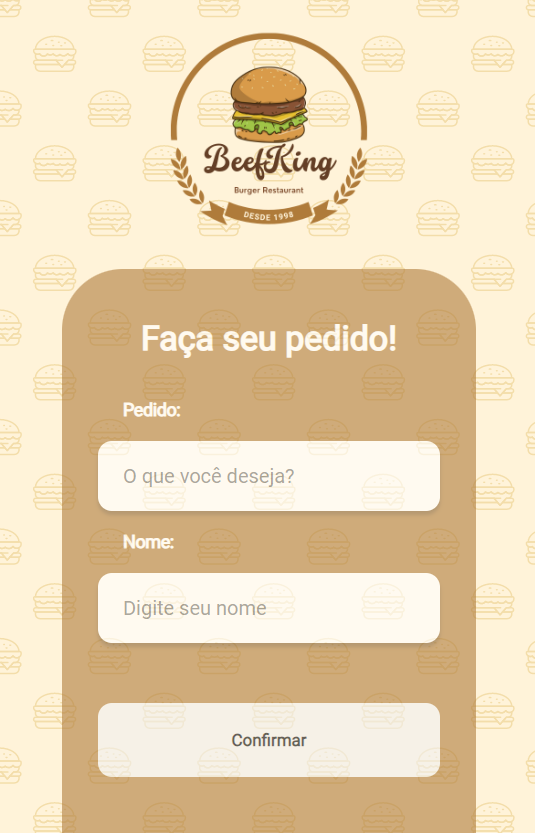
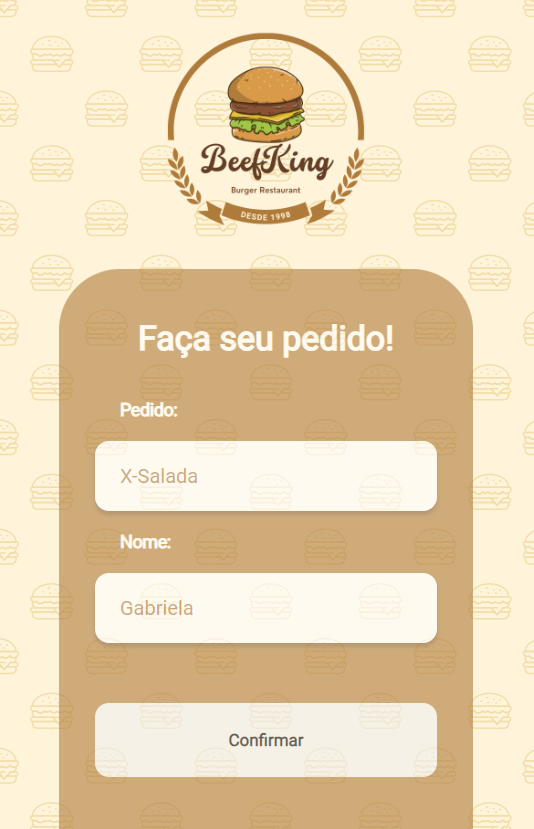
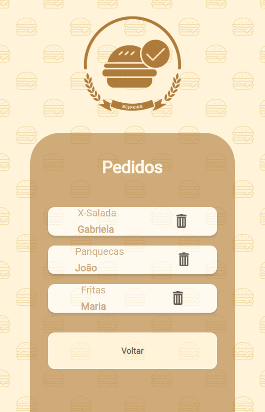

# BeefKign - Burger Restaurant 🍔

## Descrição
Este é um pequeno projeto de um restaurante de hambúrguer chamado beefKign. O objetivo principal é criar uma página de cadastro de usuários e pedidos, onde os usuários podem fazer seus pedidos e incluir seus nomes para identificação. O projeto foi desenvolvido usando React.js no front-end e Node.js no back-end.

## Funcionalidades
- **Cadastro de Pedido:** Os usuários podem anotar seus pedidos no campo de entrada.
- **Cadastro de Nome do Usuário:** Os usuários podem inserir seus nomes para identificação.
- **Exclusão:** Em caso de erro de digitação, os usuários podem excluir o pedido ou o nome e refazer.

## Tecnologias Utilizadas
- React.js
- Node.js
- Styled-components para estilização
- Axios para realização de requisições HTTP
- React-router-dom para navegação entre páginas

## Como Executar
### Front-end
1. Clone este repositório.
2. Navegue até a pasta **frontend-react**.
3. Execute `npm install` para instalar as dependências.
4. Execute `npm start` para iniciar o servidor de desenvolvimento.

### Back-end
1. Com este repositório clonado:
2. Navegue até a pasta **backend-node**.
3. Execute `npm install` para instalar as dependências.
4. Execute `npm start` para iniciar o servidor.

## Screenshots
 
 
 